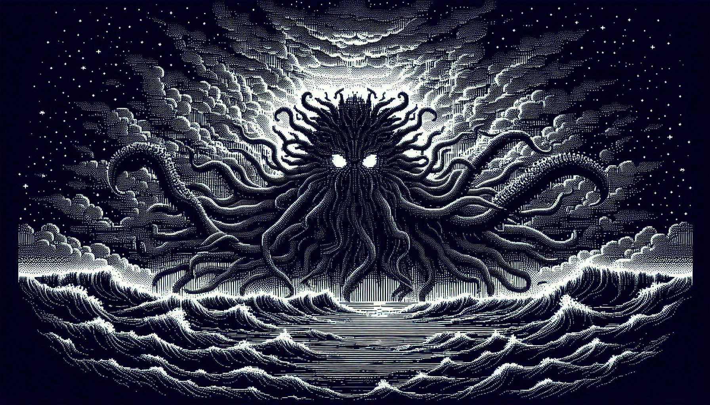

# Echoes of the Abyss


### A Horror Deckbuilder in Java.

Projeto desenvolvido para a disciplina MC322 - Programação Orientada a Objetos (POO) da Universidade Estadual de Campinas (UNICAMP).

Inspirado no gênero roguelike deckbuilder e tomando como referência o jogo *Slay the Spire*, **Echoes of the Abyss** transporta o jogador para um cenário de horror cósmico inspirado nas obras de H. P. Lovecraft.

Durante as tarefas da disciplina, o sistema será desenvolvido de forma incremental, adicionando novas mecânicas, cartas e melhorias de arquitetura.

## 📖 Descrição do Projeto

Em Echoes of the Abyss, o jogador assume o papel de um investigador que se aventura em regiões esquecidas em busca de conhecimento proibido.

Durante sua jornada, ele enfrenta criaturas e entidades que desafiam a compreensão humana. Para sobreviver, o jogador utiliza um baralho de cartas místicas, cada uma representando uma ação, habilidade ou manifestação de conhecimento oculto.

Agora o sistema conta também com cartas de efeito, tornando o combate mais dinâmico e estratégico.

## Tipos de Cartas
O jogo atualmente possui:

### Cartas Básicas
- **Carta de Dano** - causa dano direto ao inimigo
- **Carta de Escudo** - concede proteção ao jogador
- **Corneta de Guerra** - aplica vulnerabilidade ao inimigo (recebe mais dano)

### Cartas de Efeito 

- **Veneno** - causa dano ao final do turno em seguida descardada
- **Atordoar** - faz o alvo perder o próximo turno
 
Na primeira etapa do projeto, o sistema de combate será baseado em decisões estratégicas sobre quais cartas utilizar.

Em seguida, a criação de efeitos que funcionam tanto para o herói quanto para o inimigo utilizando um sistema genérico baseado em entidades.

O objetivo do jogador é derrotar o inimigo antes que sua vitalidade ou sanidade se esgote, utilizando estratégia e gerenciamento de recursos.

## 🎮 Como Jogar

Durante o combate:

- O jogador possui um baralho com 30 cartas com diferentes habilidades.
- No início de cada turno, o jogador compra 6 cartas do baralho.
- Cada carta possui um custo de energia para ser utilizada.
- O jogador pode usar quantas cartas quiser, desde que tenha energia suficiente.
- As cartas permitem causar dano, ganhar escudo ou utilizar habilidades especiais, como a Corneta de Guerra.
- Ao final do turno do jogador, sua mão é descartada.
- Em seguida, os inimigos realizam suas ações, atacando ou aplicando efeitos.
- Inimigo mostra a intenção do próximo turno.
  
O combate termina quando:

- O herói é derrotado, ou  
- Todos os inimigos são derrotados.

### Controles

- 1,2,... -> usar carta
- "99" -> encerra o turno.
- "0" -> desistir da batalha.

## 🧠 Conceitos Trabalhados

- Programação Orientada a Objetos (POO)
- Encapsulamento (cartas, jogador, inimigo)
- Herança
- Polimorfismo
- Modularização de código
- Estruturação de projetos Java
- Modelagem de entidades de jogo

## 🏗 Estrutura do Projeto

```
Tarefa_MC322B/
├── src/
│   ├── App.java
│   └── Entidade.java
│      ├── Herói.java
│      └── Inimigo.java
│   └── Carta.java
│        ├── CartaCorneta.java
│        ├── CartaDano.java
│        └── CartaEscudo.java
│   ├── GerenciamentoDeCartas
│   └── Efeito.java
│        ├── EfeitoAtordoar.java
│        └── EfeitoVeneno.java
├── bin/
├── lib/
├── .gitignore
└── README.md
```
## ▶️ Como Executar

1. Clonar o repositório
``` </> Bash
git clone https://github.com/denisesot/Tarefa_MC322B.git
```

2. Entrar na pasta do projeto
``` </> Bash
cd Tarefa_MC322B
```

3. Compilar o código
``` </> Bash
javac src/App.java
```
4. Executar
``` </> Bash
java src/App.java
```

## 🛠 Tecnologias Utilizadas

- Java 25
- Visual Studio Code
- Git
- GitHub

## 👨‍🏫 Disciplina

MC322 - Programação Orientada a Objetos
Instituto de Computação - UNICAMP

Professor: Marcelo da Silva Reis

## 👥 Autores

Projeto desenvolvido por:

- **Caio Dominiguetti Velloso** - RA253448
- **Denise Tuda** - RA299429

## 📌 Observação

Este projeto possui fins educacionais e foi desenvolvido como parte das atividades avaliativas da disciplina.
