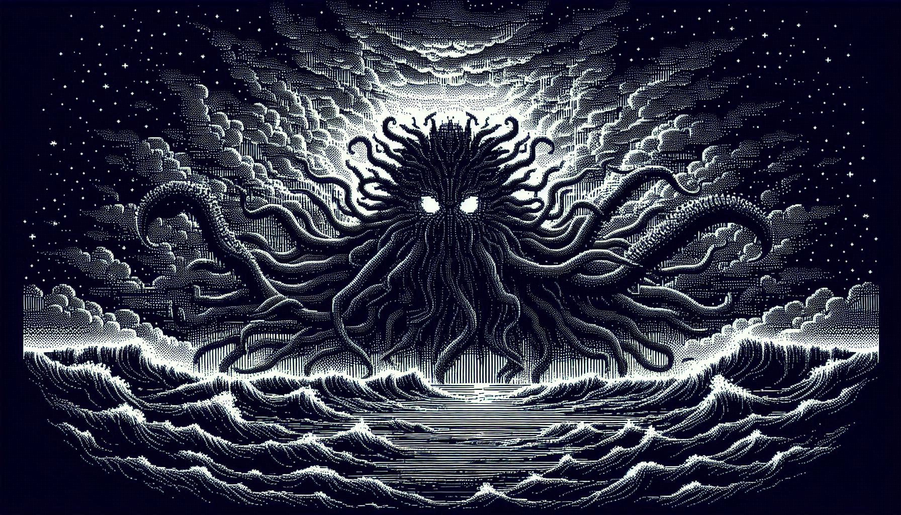
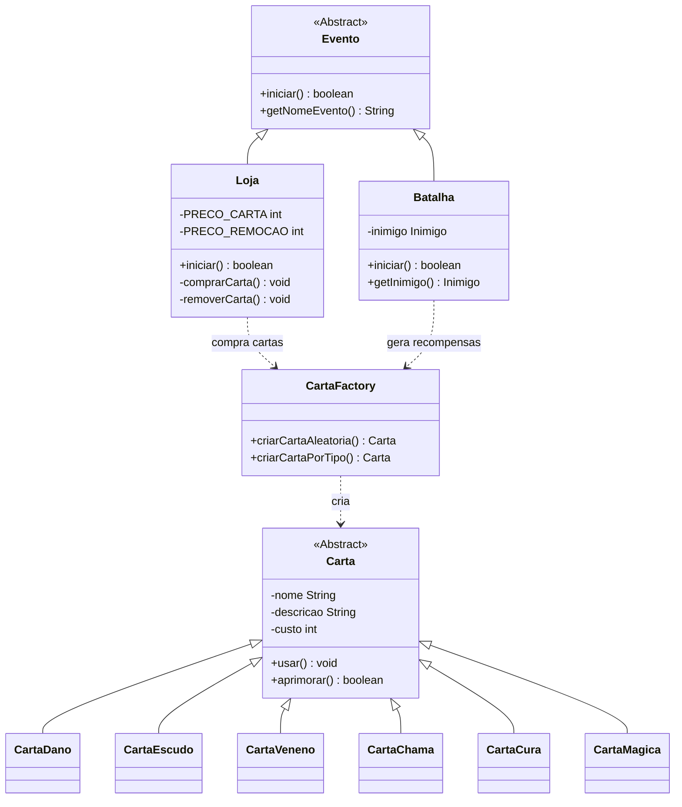
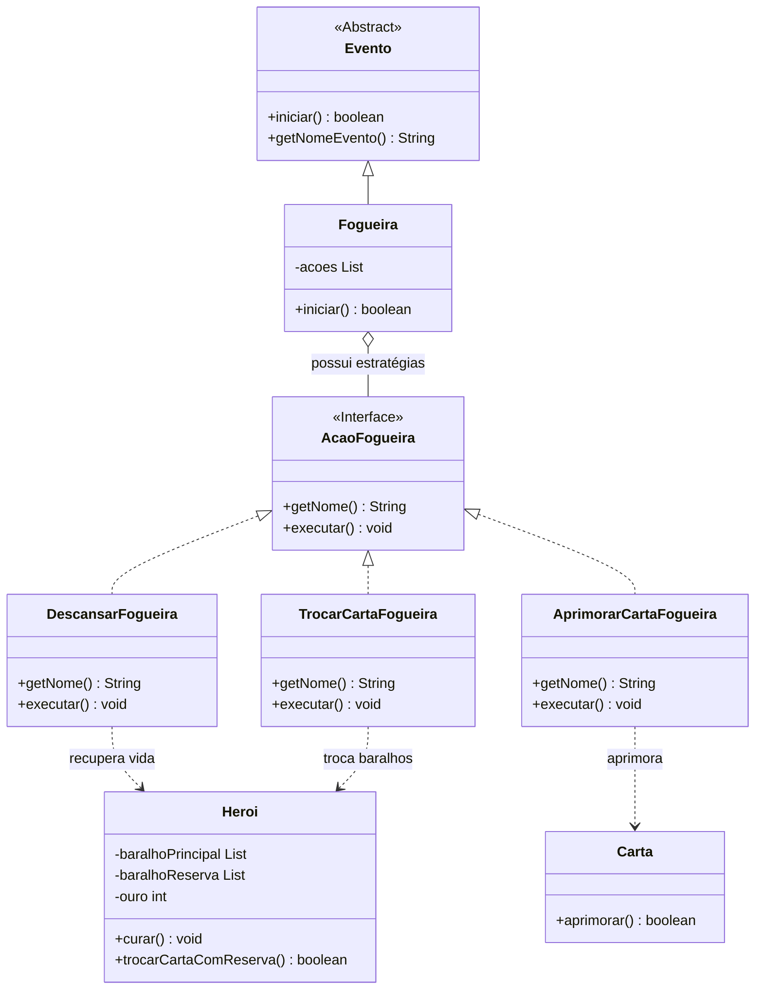

# Echoes of the Abyss


### A Horror Deckbuilder in Java.

Projeto desenvolvido para a disciplina MC322 - Programação Orientada a Objetos (POO) da Universidade Estadual de Campinas (UNICAMP).

Inspirado no gênero roguelike deckbuilder e tomando como referência o jogo *Slay the Spire*, **Echoes of the Abyss** transporta o jogador para um cenário de horror cósmico inspirado nas obras de H. P. Lovecraft.

O sistema foi desenvolvido de forma incremental ao longo das tarefas da disciplina, adicionando novas mecânicas, cartas e melhorias de arquitetura.

## 📖 Descrição do Projeto

Em Echoes of the Abyss, o jogador assume o papel de um investigador que se aventura em regiões esquecidas em busca de conhecimento proibido.

Durante sua jornada, ele enfrenta criaturas e entidades que desafiam a compreensão humana. Para sobreviver, o jogador utiliza um baralho de cartas místicas, cada uma representando uma ação, habilidade ou manifestação de conhecimento oculto.

## Funcionalidades Atuais
- Sistema de combate por turnos
- Baralho com compra, descarte e embaralhamento
- Sistema de energia (mana)
- Inimigos com intenções visíveis
- Sistema de efeitos contínuos (status)
- Aplicação de múltiplos efeitos simultâneos
- Sistema de mapa com eventos de batalha, escolha, loja e fogueira
- Progressão entre batalhas com vida, ouro e baralho persistentes
- Recompensa de ouro e escolha de carta após batalhas vencidas
- Baralho reserva para cartas ganhas ou compradas
- Troca controlada de cartas na fogueira, mantendo o tamanho do baralho atual
- Interface interativa no terminal com arte ASCII, cores, animação simples,
menus navegáveis, histórico de batalha e telas limpas
- Documentação completa com **Javadoc**
- Build automatizado com **Gradle**

## 🧩 Arquitetura do Sistema

O projeto é dividido em componentes principais:

- **Entidades**: representam personagens do jogo (Herói e Inimigo)
- **Cartas**: encapsulam ações jogáveis com custo e efeito
- **Efeitos**: sistema modular baseado em interface
- **Gerenciador de Cartas**: controla fluxo de compra, descarte e uso
- **Eventos**: nós do mapa que executam batalhas, escolhas e progressão
- **Progressão**: loja, fogueira, ouro e melhoria de cartas

O sistema de efeitos segue um modelo semelhante ao padrão Observer,
onde as entidades mantêm uma coleção de efeitos ativos que são aplicados
automaticamente a cada turno.

## Mapa, Eventos e Progressão

O mapa é formado por nós (`NoMapa`) que armazenam objetos do tipo `Evento`.
Como `Batalha`, `Escolha`, `Loja` e `Fogueira` herdam de `Evento`, o fluxo do
jogo consegue executar qualquer tipo de acontecimento pelo mesmo método
`iniciar(Heroi, Scanner)`.

Entre batalhas, o herói mantém:

- vida atual;
- ouro;
- baralho principal (atual), usado nas batalhas;
- baralho reserva, onde entram cartas ganhas como recompensa ou compradas;
- melhorias feitas nas cartas.

Efeitos temporários de combate são limpos ao iniciar uma nova batalha, evitando
que veneno, queimadura ou atordoamento fiquem ativos fora do combate.

## Saída Visual no Terminal

A interface usa a classe `TerminalUI` para centralizar a apresentação visual.
Ela limpa a tela a cada atualização importante, aplica cores ANSI, mostra cartas
em caixas, anima levemente os personagens e permite navegar por menus com setas
e Enter. As principais telas interativas são:

- combate, com seleção de cartas, encerramento de turno e consulta ao registro;
- recompensas de batalha;
- mapa interativo com escolha do próximo nó;
- loja;
- fogueira;
- seleção de cartas para aprimorar, remover ou trocar.

Durante o combate, os acontecimentos importantes aparecem em uma caixa própria
por alguns segundos e também são guardados em um histórico. O jogador pode
pressionar `R` para abrir o registro da batalha caso perca alguma mensagem.

As artes ASCII ficam em arquivos `.txt` separados dentro de
`app/src/main/resources/art`, como:

- `heroi.txt`;
- `cultista.txt`;
- `aberracao.txt`;
- `cthulhu.txt`.

Isso evita deixar artes grandes e strings longas espalhadas no código das
classes de batalha, cartas e inimigos.

## Implementações Adicionadas

O jogo foi fechado como uma experiência com progressão entre
batalhas. O mapa deixou de conter apenas combates e passou a aceitar eventos
genéricos por meio da classe abstrata `Evento`. Cada nó (`NoMapa`) armazena um
`Evento`, e o jogo executa todos pelo mesmo método `iniciar(Heroi, Scanner)`.

Foram implementados:

- `Batalha`, que herda de `Evento` e oferece ouro e escolha de carta ao vencer;
- `Escolha`, que representa um evento narrativo com consequência clara;
- `Loja`, que permite gastar ouro para comprar ou remover cartas;
- `Fogueira`, que permite descansar, aprimorar cartas e trocar cartas com a
reserva;
- `CartaFactory`, usada para criar recompensas e ofertas aleatórias;
- `TerminalUI`, usada para manter as interações claras e organizadas.

O estado do herói persiste entre batalhas. Isso inclui vida atual, ouro,
baralho atual, baralho reserva e cartas aprimoradas. Efeitos temporários de
combate são limpos no início de cada nova batalha.

### Sistema 1: Loja do Arquivista

A `Loja` é um evento do mapa que permite gastar ouro para comprar cartas novas
ou remover uma carta do baralho. Cartas compradas vão para o baralho reserva,
mantendo o baralho atual controlado até que o jogador passe por uma fogueira.

O jogador recebe ouro ao vencer batalhas e pode usar esse recurso na loja. As
ofertas são geradas aleatoriamente com `CartaFactory`. A remoção de carta reduz
o baralho atual, funcionando como uma forma de refinamento do baralho.

Padrão de projeto utilizado: **Factory Method**.
Fonte consultada: Refactoring Guru - https://refactoring.guru/design-patterns/factory-method

No projeto, a classe `CartaFactory` centraliza a criação de cartas. A loja e as
recompensas de batalha usam essa fábrica para gerar cartas sem depender
diretamente de todos os construtores concretos.

Diagrama UML simplificado:


```mermaid
classDiagram
    class Evento {
        <<Abstract>>
        +iniciar() boolean
        +getNomeEvento() String
    }

    class Loja {
        -PRECO_CARTA int
        -PRECO_REMOCAO int
        +iniciar() boolean
        -comprarCarta() void
        -removerCarta() void
    }

    class Batalha {
        -inimigo Inimigo
        +iniciar() boolean
        +getInimigo() Inimigo
    }

    class CartaFactory {
        +criarCartaAleatoria() Carta
        +criarCartaPorTipo() Carta
    }

    class Carta {
        <<Abstract>>
        -nome String
        -descricao String
        -custo int
        +usar() void
        +aprimorar() boolean
    }

    Evento <|-- Loja
    Evento <|-- Batalha
    Loja ..> CartaFactory : compra cartas
    Batalha ..> CartaFactory : gera recompensas
    CartaFactory ..> Carta : cria
    Carta <|-- CartaDano
    Carta <|-- CartaEscudo
    Carta <|-- CartaVeneno
    Carta <|-- CartaChama
    Carta <|-- CartaCura
    Carta <|-- CartaMagica
```

### Sistema 2: Fogueira

A `Fogueira` é um evento do mapa que oferece três formas de progressão:
descansar para recuperar 30% da vida máxima, aprimorar uma carta permanente
do baralho atual ou trocar cartas entre o baralho atual e o baralho reserva.
Uma carta aprimorada recebe `+` no nome e, quando possível, passa a custar
1 energia a menos.

Na fogueira, o evento funciona como um menu que permanece aberto até o jogador
escolher seguir viagem. Descansar e aprimorar carta só podem ser feitos uma vez
por fogueira. A troca de cartas pode ser feita quantas vezes o jogador quiser.

As cartas escolhidas como recompensa após uma batalha vencida vão para o
baralho reserva. Elas só entram no baralho usado em combate quando o jogador
chega a uma fogueira e troca uma carta atual por uma carta reserva. Essa troca
preserva o tamanho do baralho atual: sempre sai uma carta e entra uma carta.

Nas telas de aprimoramento e troca, a seleção mostra até 9 cartas por vez para
facilitar a visualização de baralhos maiores.

Padrão de projeto utilizado: **Strategy**.
Fonte consultada: Refactoring Guru - https://refactoring.guru/design-patterns/strategy

No projeto, `AcaoFogueira` define a interface das ações disponíveis. A fogueira
mantém uma lista de estratégias e executa a escolhida pelo jogador, permitindo
adicionar novas ações futuramente sem reescrever a classe `Fogueira`.

Diagrama UML simplificado:


```mermaid
classDiagram
    class Evento {
        <<Abstract>>
        +iniciar() boolean
        +getNomeEvento() String
    }

    class Fogueira {
        -acoes List
        +iniciar() boolean
    }

    class AcaoFogueira {
        <<Interface>>
        +getNome() String
        +executar() void
    }

    class DescansarFogueira {
        +getNome() String
        +executar() void
    }

    class AprimorarCartaFogueira {
        +getNome() String
        +executar() void
    }

    class TrocarCartaFogueira {
        +getNome() String
        +executar() void
    }

    class Heroi {
        -baralhoPrincipal List
        -baralhoReserva List
        -ouro int
        +curar() void
        +trocarCartaComReserva() boolean
    }

    class Carta {
        +aprimorar() boolean
    }

    Evento <|-- Fogueira
    Fogueira o-- AcaoFogueira : possui estratégias
    AcaoFogueira <|.. DescansarFogueira
    AcaoFogueira <|.. AprimorarCartaFogueira
    AcaoFogueira <|.. TrocarCartaFogueira
    DescansarFogueira ..> Heroi : recupera vida
    AprimorarCartaFogueira ..> Carta : aprimora
    TrocarCartaFogueira ..> Heroi : troca baralhos
```

## Tipos de Cartas
O jogo atualmente possui:

### Cartas Básicas
- **Carta de Dano** - causa dano direto ao inimigo
- **Carta de Escudo** - concede proteção ao jogador
- **Cura** – recupera vida
- **Energia** – recupera mana

### Cartas Especiais
- **Corneta de Guerra** - aplica vulnerabilidade ao inimigo (recebe mais dano)
- **Sacrifício** – causa alto dano com custo de vida
- **Magia (Chaos)** – aplica aleatoriamente efeitos como veneno, atordoamento ou queimadura. 

### Cartas de Efeito 

- **Veneno** - causa dano ao longo do turno e depois é removido
- **Atordoar** - faz o alvo perder o próximo turno
- **Queimadura** – dano contínuo por turnos

## Sistema de Efeitos
O jogo utiliza um sistema baseado em interface:

```java
public interface Efeito {
    void aplicar();
    void reduzirDuracao();
    boolean expirou();
}
```
Isso permite:
- Reutilização da lógica
- Extensão fácil para novos efeitos
- Aplicação dinâmica em qualquer entidade

O objetivo do jogador é derrotar o inimigo antes que sua vitalidade ou sanidade se esgote, utilizando estratégia e gerenciamento de recursos.

## 🎮 Como Jogar

### Fluxo Geral

O jogador percorre um mapa em árvore. Cada nó pode ser uma batalha, escolha,
loja ou fogueira. Após completar um evento, o jogador escolhe o próximo caminho
por uma tela de mapa interativa.

Durante as batalhas:

- O jogador possui um baralho com 20 cartas.
- No início de cada turno, o jogador compra 6 cartas do baralho.
- Cada carta possui um custo de energia para ser utilizada.
- O jogador pode usar cartas enquanto tiver mana suficiente.
- As cartas permitem causar dano, ganhar escudo ou utilizar habilidades especiais, como a Corneta de Guerra.
- Ao final do turno do jogador, sua mão é descartada.
- Em seguida, os inimigos realizam suas ações, atacando ou aplicando efeitos.
- O inimigo mostra sua intenção no painel de combate.
- Ao vencer uma batalha, o jogador ganha ouro e escolhe 1 carta entre 3 opções.
- A carta escolhida vai para o baralho reserva.
- Na fogueira, é possível trocar uma carta do baralho principal por uma da reserva,
mantendo o tamanho do baralho principal.
- Em cada fogueira, descansar e aprimorar carta podem ser feitos uma vez cada.
- A troca entre baralho principal e reserva pode ser repetida livremente antes de
seguir para o próximo nó do mapa.
  
O combate termina quando:

- O herói é derrotado, ou  
- Todos os inimigos são derrotados.

### Controles

- Setas -> navegar por cartas e menus
- Enter -> confirmar a opção selecionada
- 1,2,... -> escolher diretamente cartas e opções
- E ou espaço -> encerrar o turno durante a batalha
- R -> abrir o registro da batalha durante o combate
- M -> abrir o mapa visual durante o combate ou na escolha de caminho
- Q ou 0 -> sair/cancelar

No mapa visual, os nós mostram o tipo de evento: `[E]` batalha, `[B]` chefe,
`[$]` loja, `[F]` fogueira e `[?]` escolha narrativa. As cores indicam a
progressão: verde é a posição atual, amarelo são caminhos disponíveis, azul são
nós já visitados e cinza indica o que ainda falta.

Observação: o jogo tenta redimensionar o terminal para melhorar a experiência
visual. Alguns terminais ou consoles embutidos de IDE podem ignorar esse pedido.
Se a tela parecer cortada, abra o terminal manualmente em uma janela maior.

## 🏗 Estrutura do Projeto

```text
Tarefa_MC322B/
├── README.md
├── cthulhu.jpg
├── gradlew
├── settings.gradle
├── app/
│   ├── build.gradle
│   └── src/
│       ├── main/
│       │   ├── java/game/echoes/
│       │   │   ├── App.java
│       │   │   ├── Jogo.java
│       │   │   ├── Mapa.java
│       │   │   ├── NoMapa.java
│       │   │   ├── TerminalUI.java
│       │   │   ├── GerenciadorDeCartas.java
│       │   │   ├── CartaFactory.java
│       │   │   │
│       │   │   ├── Entidade.java
│       │   │   │   ├── Heroi.java
│       │   │   │   └── Inimigo.java
│       │   │   │       ├── Cultista.java
│       │   │   │       ├── Aberracao.java
│       │   │   │       └── CthulhuBoss.java
│       │   │   │
│       │   │   ├── Carta.java
│       │   │   │   ├── CartaAtordoar.java
│       │   │   │   ├── CartaChama.java
│       │   │   │   ├── CartaCorneta.java
│       │   │   │   ├── CartaCura.java
│       │   │   │   ├── CartaDano.java
│       │   │   │   ├── CartaEnergetica.java
│       │   │   │   ├── CartaEscudo.java
│       │   │   │   ├── CartaMagica.java
│       │   │   │   ├── CartaSacrificio.java
│       │   │   │   └── CartaVeneno.java
│       │   │   │
│       │   │   ├── Efeito.java
│       │   │   │   ├── EfeitoAtordoar.java
│       │   │   │   ├── EfeitoQueimadura.java
│       │   │   │   └── EfeitoVeneno.java
│       │   │   │
│       │   │   ├── Evento.java
│       │   │   │   ├── Batalha.java
│       │   │   │   ├── Escolha.java
│       │   │   │   ├── Fogueira.java
│       │   │   │   └── Loja.java
│       │   │   │
│       │   │   └── AcaoFogueira.java
│       │   │       ├── AprimorarCartaFogueira.java
│       │   │       ├── DescansarFogueira.java
│       │   │       └── TrocarCartaFogueira.java
│       │   └── resources/art/
│       │       ├── heroi.txt
│       │       ├── cultista.txt
│       │       ├── aberracao.txt
│       │       └── cthulhu.txt
│       └── test/java/
│           ├── game/echoes/
│           └── org/example/
└── build.gradle
```

Na árvore acima, as classes indentadas abaixo de outra classe representam
herança ou implementação. Por exemplo, `CartaAtordoar.java` fica abaixo de
`Carta.java` porque `CartaAtordoar extends Carta`; já `DescansarFogueira.java`
fica abaixo de `AcaoFogueira.java` porque `DescansarFogueira implements
AcaoFogueira`.

## ▶️ Como Executar

### Usando Gradle

```bash 
./gradlew run
```

## 📄 Documentação

A documentação completa do projeto foi gerada utilizando Javadoc.

Para acessá-la:

```bash
./gradlew javadoc
```

Em seguida abra no terminal: 

```bash
open app/build/docs/javadoc/index.html   # Mac
xdg-open app/build/docs/javadoc/index.html   # Linux
```
## 📝 Testes Unitários

O projeto utiliza testes unitários para validação das entidades e regras de jogo.

Para executar:

```bash
./gradlew test
```

## 🛠 Tecnologias Utilizadas

- Gradle
- Java 25
- Visual Studio Code
- Git
- GitHub

## 🧠 Conceitos Trabalhados

- Programação Orientada a Objetos (POO)
- Encapsulamento (cartas, jogador, inimigo)
- Herança
- Polimorfismo
- Padrão de projeto (Observer-like para efeitos)
- Modularização de código
- Estruturação de projetos com Gradle
- Documentação com Javadoc
- Padrões de projeto: Factory Method e Strategy

## 👨‍🏫 Disciplina

MC322 - Programação Orientada a Objetos
Instituto de Computação - UNICAMP

Professor: Marcelo da Silva Reis

## 👥 Autores

Projeto desenvolvido por:

- **Caio Dominiguetti Velloso** - RA253448
- **Denise Tuda** - RA299429

## 📌 Observação

Este projeto possui fins educacionais e foi desenvolvido como parte das atividades avaliativas da disciplina.
